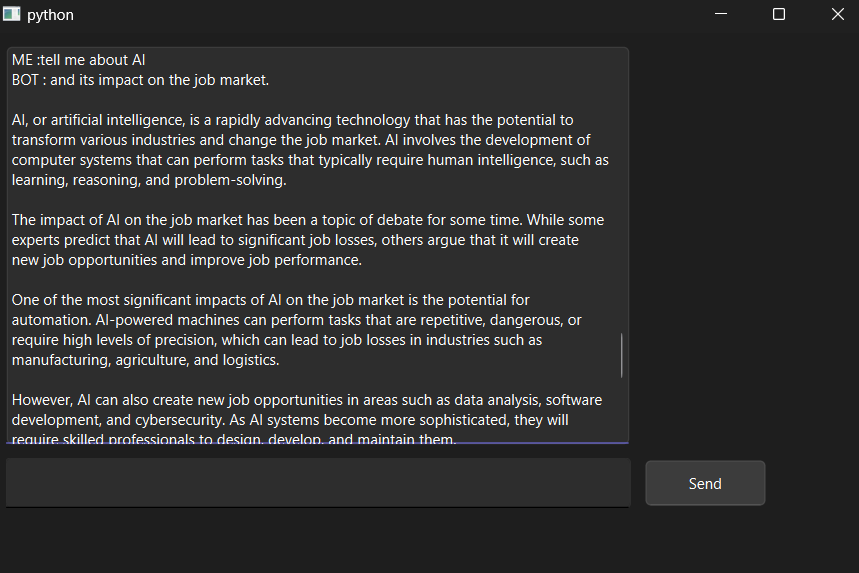

# ChatBox Application

This is a simple ChatBox application built using PyQt6 for the GUI and a backend chatbot for handling responses. The application allows users to input text, send it, and receive responses from the chatbot.

## Features

- **Graphical User Interface**: Built using PyQt6, providing a user-friendly interface.
- **Chat Functionality**: Users can send messages and receive responses from the chatbot.
- **Threading**: Ensures the application remains responsive while processing chatbot responses.

## Requirements

- Python 3.x
- PyQt6
- threading
- backend.Chatbot() module
- HuggingFace Api

## Installation

1. Clone the repository:

   ```sh
   git clone https://github.com/yourusername/chatbox-application.git
   cd chatbox-application
   ```

2. Install the required packages:

   ```sh
   pip install PyQt6
   ```

3. Ensure the `backend.py` file is in the same directory, containing the `Chatbot` class.

## Usage

1. Run the application:

   ```sh
   python main.py
   ```

2. The application window will open. Type a message in the input field and press the "Send" button or hit "Enter".

3. The message will appear in the chat area with a "ME:" prefix, and the chatbot's response will appear with a "BOT:" prefix.

## Code Overview

### Classes and Functions

#### **ChatBoxWindow:** This class defines the main window of the chat application.

It contains the following methods:

- **init:** Initializes the GUI components, including the chat area, input field, and send button.
- **send_message:** Handles sending messages. It appends the user's message to the chat area, clears the input field, and starts a new thread to get the bot's response.
- **get_bot_response:** Fetches the bot's response and appends it to the chat area.



## Acknowledgments

- PyQt6 documentation for providing comprehensive guides and examples.
- All contributors to this project.
