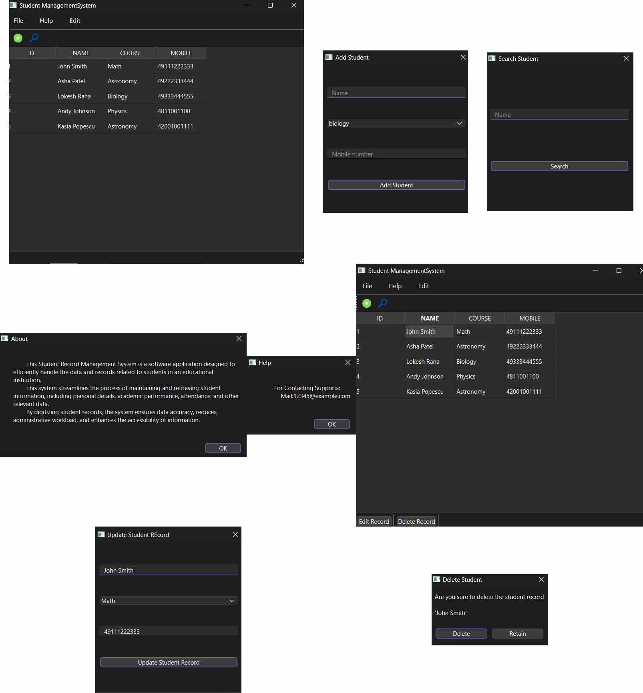

# Student Management System

This is a Student Management System application built using PyQt6 for the GUI and MySQL for the database. The application allows users to manage student records, including adding, searching, updating, and deleting student information.

## Table of Contents

- [Features](#features)
- [Requirements](#requirements)
- [Installation](#installation)
- [Usage](#usage)
- [Code Overview](#code-overview)
- [Contributing](#contributing)
- [Acknowledgments](#acknowledgments)

---

## Features

- **Graphical User Interface**: Built using PyQt6, providing a user-friendly interface.
- **Student Management**: Add, search, update, and delete student records.
- **Database Connection**: Connects to a MySQL database to store and retrieve student information.
- **Dialogs and Menus**: Uses dialogs for user input and menus for navigation and actions.

## Requirements

- Python 3.x
- PyQt6
- mysql-connector-python

## Installation

1. Clone the repository:

   ```sh
   git clone https://github.com/yourusername/student-management-system.git
   cd student-management-system
   ```

2. Install the required packages:

   ```sh
   pip install PyQt6 mysql-connector-python
   ```

3. Ensure you have a MySQL server running and a database named `school` with a table `students`:

   ```sql
   CREATE DATABASE school;
   USE school;
   CREATE TABLE students (
       id INT AUTO_INCREMENT PRIMARY KEY,
       name VARCHAR(255) NOT NULL,
       course VARCHAR(255) NOT NULL,
       mobile VARCHAR(255) NOT NULL
   );
   ```

4. Update the database connection credentials in the `DataBaseConnection` class if necessary:

   ```py
   class DataBaseConnection:
       def __init__(self, host="localhost", user="root", password="yourpassword", database="school"):
           self.host = host
           self.user = user
           self.password = password
           self.database = database
   ```

## Usage

1. Run the application:

   ```sh
   python main.py
   ```

2. The application window will open, displaying the student records in a table.

3. Use the "Add Student" option in the File menu or toolbar to add a new student.

4. Use the "Search" option in the Edit menu or toolbar to search for a student by name.

5. Click on a student record in the table to enable the "Edit Record" and "Delete Record" buttons in the status bar.

6. Use the "Edit Record" button to update the selected student's information.

7. Use the "Delete Record" button to delete the selected student's record.

## Code Overview

### `main.py`

The `main.py` script defines the main application window and various dialogs for managing student records.

#### Classes and Functions

- **DataBaseConnection**: Handles the connection to the MySQL database.
- **MainWindow**: Defines the main window of the application.

  - `load_data`: Loads student records from the database and populates the table.
  - `insert`: Opens the `InsertDialog` to add a new student.
  - `search`: Opens the `SearchDialog` to search for a student.
  - `cell_clicked`: Enables the "Edit Record" and "Delete Record" buttons when a table cell is clicked.
  - `edit`: Opens the `EditDialog` to update the selected student's information.
  - `delete`: Opens the `DeleteDialog` to delete the selected student's record.
  - `about`: Opens the `AboutDialog` to show information about the application.
  - `help`: Opens the `HelpDialog` to show help information.

- **InsertDialog**: Dialog for adding a new student.

  - `addstudent`: Adds the new student to the database and refreshes the table.

- **SearchDialog**: Dialog for searching a student by name.

  - `searchstudent`: Searches the database for the student and highlights the matching record in the table.

- **EditDialog**: Dialog for updating a student's information.

  - `editstudent`: Updates the student's information in the database and refreshes the table.

- **DeleteDialog**: Dialog for deleting a student record.

  - `retain`: Closes the dialog without deleting the student record.
  - `delete`: Deletes the student record from the database and refreshes the table.

- **AboutDialog**: Dialog showing information about the application.

- **HelpDialog**: Dialog showing help information.

## Contributing

1. Fork the repository.
2. Create a new branch (`git checkout -b feature-branch`).
3. Make your changes.
4. Commit your changes (`git commit -m 'Add new feature'`).
5. Push to the branch (`git push origin feature-branch`).
6. Open a pull request.

## Acknowledgments

- PyQt6 documentation for providing comprehensive guides and examples.
- All contributors to this project.

---



Feel free to customize this README file as per your project's specifics and requirements.
