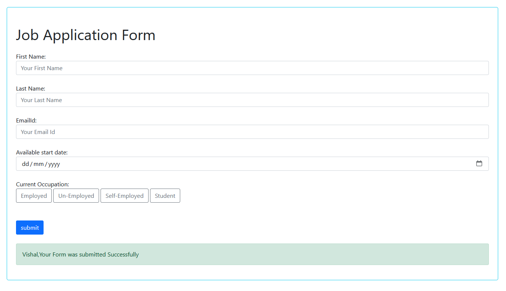

# Flask Form Submission App

This is a Flask web application that allows users to submit a form with their personal details. Upon submission, the details are stored in a SQLite database, and a confirmation email is sent to the user.

## Table of Contents

- [Free Resources](#free-resources)
- [Features](#features)
- [Requirements](#requirements)
- [Installation](#installation)
- [Usage](#usage)
- [Code Overview](#code-overview)
- [Contributing](#contributing)
- [Acknowledgments](#acknowledgments)

## Free Resources

- [Flask Documentation](https://flask.palletsprojects.com/en/2.1.x/)
- [SQLAlchemy Documentation](https://docs.sqlalchemy.org/en/14/)
- [Flask-Mail Documentation](https://pythonhosted.org/Flask-Mail/)
- [Python Official Documentation](https://docs.python.org/3/)
- [Jinja2 Documentation](https://jinja.palletsprojects.com/en/3.0.x/)

## Features

- **Form Submission**: Users can submit their personal details through a form.
- **Database Integration**: Stores submitted form data in a SQLite database.
- **Email Notification**: Sends a confirmation email to the user upon form submission.

## Requirements

- Python 3.x
- Flask
- Flask-Mail
- Flask-SQLAlchemy

## Installation

1. Clone the repository:

   ```sh
   git clone https://github.com/yourusername/flask-form-submission-app.git
   cd flask-form-submission-app
   ```

2. Create a virtual environment and activate it:

   ```sh
   python -m venv venv
   source venv/bin/activate  # On Windows, use `venv\Scripts\activate`
   ```

3. Install the required packages:

   ```sh
   pip install Flask Flask-Mail Flask-SQLAlchemy
   ```

4. Set up the environment variable for email password:
   ```sh
   export password1='your-email-password'  # On Windows, use `set password1='your-email-password'`
   ```

## Usage

1. Run the application:

   ```sh
   python app.py
   ```

2. Open your web browser and navigate to `http://127.0.0.1:5001/`.

3. Fill out the form and submit it. You will receive a confirmation email with your details.

## Code Overview

### `app.py`

The `app.py` script defines the main application logic, including form submission handling and email notification.

#### Configuration

- `SECRET_KEY`: Used for session management and flash messages.
- `SQLALCHEMY_DATABASE_URI`: URI for connecting to the SQLite database.
- `MAIL_SERVER`: SMTP server for sending emails.
- `MAIL_PORT`: Port for the SMTP server.
- `MAIL_USE_SSL`: Use SSL for secure email transmission.
- `MAIL_USERNAME`: Email address used for sending emails.
- `MAIL_PASSWORD`: Password for the email account (set as an environment variable).

#### Routes

- **`/`**: Handles GET and POST requests. Displays the form and processes form submissions.

#### Database Model

- **Form**: Represents the form data with fields for first name, last name, email, date, and occupation.

#### Form Submission

- Collects form data and stores it in the database.
- Sends a confirmation email to the user with their submitted details.
- Displays a success message upon successful submission.

## Contributing

1. Fork the repository.
2. Create a new branch (`git checkout -b feature-branch`).
3. Make your changes.
4. Commit your changes (`git commit -m 'Add new feature'`).
5. Push to the branch (`git push origin feature-branch`).
6. Open a pull request.

## Acknowledgments

- Flask documentation for providing comprehensive guides and examples.
- SQLAlchemy and Flask-Mail documentation for detailed instructions and examples.
- All contributors to this project.

---


Feel free to customize this README file as per your project's specifics and requirements.
