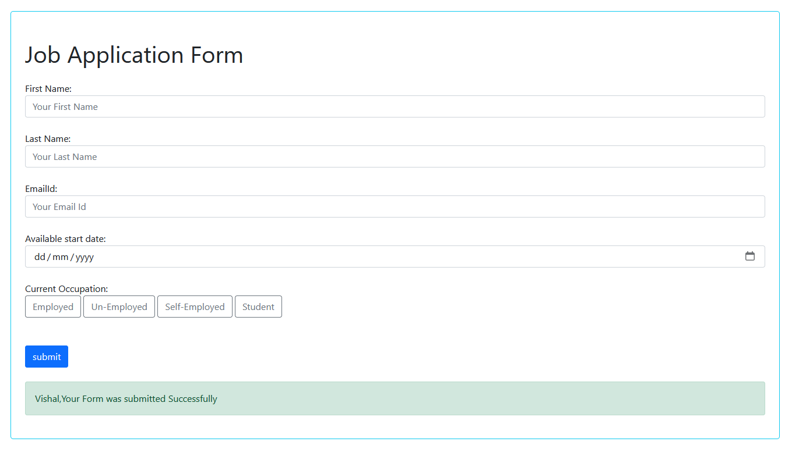

# Job Application Django Project

This is a Django project for a job application form that allows users to submit their details. It sends a confirmation email upon form submission and stores the data in a SQLite database.

## Features

- **Form Submission**: Users can submit their personal details through a form.
- **Database Integration**: Stores submitted form data in a SQLite database.
- **Email Notification**: Sends a confirmation email to the user upon form submission.

## Requirements

- Python 3.x
- Django
- django-crispy-forms
- SQLite (included with Python)
- Email service credentials (Gmail in this example)

## Installation

1. Clone the repository:

    ```bash
    git clone https://github.com/yourusername/job-application-django.git
    cd job-application-django
    ```

2. Create and activate a virtual environment:

    ```bash
    python -m venv env
    source env/bin/activate   # On Windows use `env\Scripts\activate`
    ```

3. Install the dependencies

4. Set up your email credentials in a `.env` file:

    ```env
    SECRET_KEY=your_secret_key
    EMAIL_HOST_USER=your_email@gmail.com
    EMAIL_HOST_PASSWORD=your_email_password
    ```

5. Apply the migrations:

    ```bash
    python manage.py migrate
    ```

6. Run the server:

    ```bash
    python manage.py runserver
    ```

7. Open your browser and go to `http://127.0.0.1:8000/`.

## Configuration

### Email Configuration

Make sure to configure your email settings in the `settings.py` file:

```python
# settings.py

EMAIL_BACKEND = 'django.core.mail.backends.smtp.EmailBackend'
EMAIL_HOST = 'smtp.gmail.com'
EMAIL_PORT = 587
EMAIL_USE_TLS = True
EMAIL_HOST_USER = os.getenv('EMAIL_HOST_USER')
EMAIL_HOST_PASSWORD = os.getenv('EMAIL_HOST_PASSWORD')

```

### Usage

- Fill out the job application form.
- Submit the form.
- Check your email for a confirmation message.

### Additional Notes

1. **Database Configuration**: Since Django uses SQLite by default, you don't need to change the database settings for this example.
2. **Email Service**: Ensure you use environment variables to store sensitive information such as email credentials.
3. **HTML Templates**: Make sure you create the `.htmls` in the templates directory.


