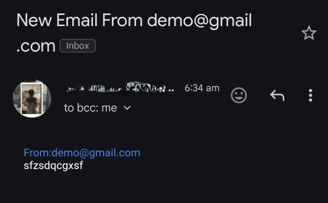

# Portfolio Page

## Key Features

### Project Listings :

- Display a list of your projects with links to their source code repositories.

- Include descriptions, technologies used, and any other relevant details.

### Interactive Web Pages :

- Use Streamlit to create interactive pages where users can explore your projects.

- Allow users to filter and search for projects based on various criteria.

### CSV File Handling:

- Implement functionality to open and display CSV files using Pandas.

- Allow users to download sample data or project-related CSV files.


### Secure Access:

- Implement SSL to ensure all communications are secure.

- Use HTTPS for all web traffic.


### Contact Forms:

- Include a contact form where users can submit inquiries or feedback.

- Use the SMTP package to send emails from the contact form submissions to your specified email address.


## Implementation Steps

### Setup Streamlit:

1. **Install Streamlit:**

    ```bash
    pip install streamlit
    ```

2. **Create a main Python file (e.g., `Home.py`) and set up the basic structure for your Streamlit app.**


---

### CSV Handling with Pandas:

1. **Install Pandas:**

    ```bash
    pip install pandas
    ```

2. **Load and display CSV files using Pandas within your Streamlit app.**

### Implement SSL:

1. Obtain an SSL certificate (e.g., from Let's Encrypt).

2. Configure your web server (e.g., nginx, Apache) to use SSL for your Streamlit app.

### SMTP Integration:

1. Use Python's `smtplib` to send emails.
2.  Configure your SMTP server settings (e.g., host, port, username, password).
3. Create a form in your Streamlit app and set up the backend to handle form submissions and send emails.





Thank you !
Happy Coding!