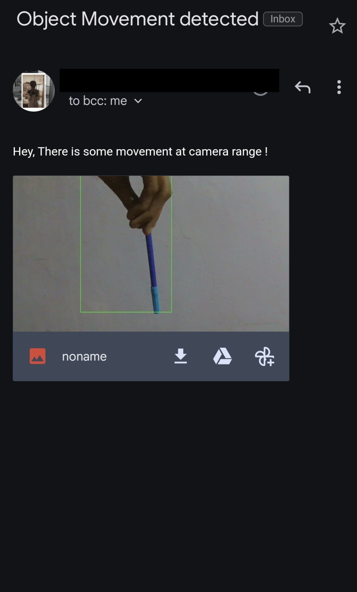

# Motion Detection System

This project is a motion detection system using OpenCV. It captures video from the default camera, detects motion, saves frames with detected motion, and sends an email with one of the images.

## Table of Contents

- [Requirements](#requirements)
- [Installation](#installation)
- [Usage](#usage)
- [Code Explanation](#code-explanation)
- [Notes](#notes)

## Requirements

- Python 3.x
- OpenCV
- Threading
- Glob
- Websocket
- Emailing

## Installation

1. Install the required Python packages using pip:

   ```sh
   pip install opencv-python
   ```

2. Ensure you have the `websocket` and `emailing` modules. If not, you can install them or replace the email sending functionality with your preferred method.

## Usage

1. Clone the repository or download the code.
2. Run the script:

   ```sh
   python main.py
   ```

3. The system will start capturing video, detecting motion, and saving frames with detected motion. When motion is detected and then stops, an email will be sent with an image of the detected motion.

4. Press the 'q' key to stop the video capture and exit the program.

## Code Explanation

- **Import Libraries**: Necessary libraries for video capture, image processing, threading, and email sending.
- **Initialize Variables**: Setup for video capture, status tracking, and frame processing.
- **Clean Folder Function**: Removes all images from the `images` folder.
- **Main Loop**:
  - Capture frames from the camera.
  - Convert frames to grayscale and apply Gaussian Blur.
  - Compute the difference between the first frame and the current frame to detect motion.
  - Apply threshold and dilation to the difference frame.
  - Find contours in the dilated frame.
  - Draw rectangles around significant contours and save the frame.
  - Track motion status and send an email if motion stops.
  - Display the processed frames.
- **Exit and Cleanup**: Release video capture and clean the images folder.

## Notes

- Adjust the contour area threshold (`10000` in the code) as needed for your specific use case.
- The email sending functionality assumes you have the necessary setup for the `send_mail` function. Modify this as needed.
- Add your preferred method for sending emails if the provided method does not work.


